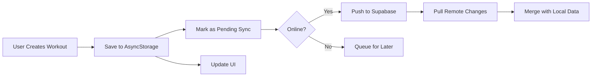

# Cloud Sync Implementation Guide

## Overview

Pulse HIIT now includes **offline-first cloud sync** powered by Supabase. This allows users to:
- ✅ Sync workouts across multiple devices
- ✅ Work offline with automatic background sync
- ✅ Secure authentication with Row Level Security (RLS)
- ✅ Real-time data updates
- ✅ Conflict resolution (last-write-wins)

## Architecture

### Offline-First Strategy

```
User Action → AsyncStorage (instant) → Sync Queue → Supabase (background)
                     ↓
                  UI Updates
```

1. **Local writes first**: All data is written to AsyncStorage immediately
2. **Queue for sync**: Changes are marked as "pending sync"
3. **Background sync**: Automatic push/pull when online
4. **Conflict resolution**: Last-write-wins based on `updated_at` timestamps

### Data Flow



## Setup Instructions

### 1. Create Supabase Project

```bash
# Go to https://supabase.com and create a new project
# Note down your project URL and anon key
```

### 2. Run Database Migration

```sql
-- Copy content from supabase/migrations/20250102_initial_schema.sql
-- Run in Supabase SQL Editor
```

### 3. Configure Environment

```bash
# Copy .env.example to .env
cp .env.example .env

# Edit .env with your Supabase credentials
EXPO_PUBLIC_SUPABASE_URL=https://your-project.supabase.co
EXPO_PUBLIC_SUPABASE_ANON_KEY=your-anon-key
```

### 4. Install Dependencies (Already Done)

```bash
npm install @supabase/supabase-js @react-native-async-storage/async-storage
```

## Usage

### Authentication

```typescript
import { useAuth } from '../hooks/useAuth';

function MyComponent() {
  const { user, signIn, signUp, signOut, isAuthenticated } = useAuth();

  const handleSignIn = async () => {
    const { error } = await signIn('email@example.com', 'password');
    if (error) {
      console.error('Sign in error:', error.message);
    }
  };

  return (
    <View>
      {isAuthenticated ? (
        <Button title="Sign Out" onPress={signOut} />
      ) : (
        <Button title="Sign In" onPress={handleSignIn} />
      )}
    </View>
  );
}
```

### Sync Status

```typescript
import { useSync } from '../hooks/useSync';

function MyScreen() {
  const { isSyncing, lastSync, pendingChanges, triggerSync } = useSync();

  return (
    <View>
      <Text>Status: {isSyncing ? 'Syncing...' : 'Ready'}</Text>
      <Text>Last sync: {lastSync?.toLocaleString()}</Text>
      <Text>Pending: {pendingChanges}</Text>
      <Button title="Sync Now" onPress={triggerSync} />
    </View>
  );
}
```

### Sync Banner (Auto-Updates)

```typescript
import { SyncStatusBanner } from '../components/SyncStatusBanner';

function HomeScreen() {
  return (
    <View>
      <SyncStatusBanner />  {/* Shows sync status automatically */}
      {/* Your screen content */}
    </View>
  );
}
```

## How Sync Works

### 1. Workout Sessions

**Local Save:**
```typescript
// useStorage.ts - saveSession()
const session = await saveSession({/*...*/});
// Automatically marked as pending sync
await SessionsSyncService.markSessionPending(session.id);
```

**Background Sync:**
```typescript
// Triggered on app foreground or manual sync
await SessionsSyncService.pushSessions(userId, sessions);
const remoteSessions = await SessionsSyncService.pullSessions(userId, lastSync);
// Merge remote with local
```

### 2. Custom Presets

**Local Save:**
```typescript
// useStorage.ts - savePreset()
const preset = await savePreset({/*...*/});
await PresetsSyncService.markPresetPending(preset.id);
```

**Background Sync:**
```typescript
await PresetsSyncService.pushPresets(userId, presets);
const remotePresets = await PresetsSyncService.pullPresets(userId, lastSync);
```

### 3. Program Progress

**Local Save:**
```typescript
// useProgramProgress.ts - completeWorkout()
await completeWorkout(programId, day);
await ProgramProgressSyncService.markProgressPending(programId);
```

**Background Sync:**
```typescript
await ProgramProgressSyncService.pushProgress(userId, progress);
const remoteProgress = await ProgramProgressSyncService.pullProgress(userId, lastSync);
```

## Conflict Resolution

**Strategy**: Last-Write-Wins (LWW)

```typescript
// Example: User edits same preset on two devices

Device A (offline):
- Modifies preset at 10:00 AM
- Saves to local AsyncStorage
- Queued for sync

Device B (online):
- Modifies same preset at 10:05 AM
- Saves to local AsyncStorage
- Immediately syncs to Supabase (updated_at: 10:05 AM)

Device A (comes online at 10:10 AM):
- Attempts to push changes
- Supabase compares timestamps
- 10:00 AM < 10:05 AM → Device B wins
- Device A pulls latest from Supabase
- Local data updated with Device B's version
```

## Security

### Row Level Security (RLS)

All tables have RLS policies that ensure users can only access their own data:

```sql
-- Example policy
CREATE POLICY "Users can view own sessions"
  ON public.workout_sessions FOR SELECT
  USING (auth.uid() = user_id);
```

**What this means:**
- No user can see another user's workouts
- Data is filtered automatically at the database level
- Even if someone gets your API key, they can't access other users' data

### API Keys

- **Anon Key**: Safe to expose in client code (limited by RLS)
- **Service Role Key**: NEVER expose (bypasses RLS) - only for backend

## Sync Triggers

Sync happens automatically in these scenarios:

1. **App Foreground**: When app becomes active
2. **Manual Trigger**: User taps sync button
3. **After Local Write**: Marks data as pending (syncs on next trigger)

```typescript
// useSync.ts
useEffect(() => {
  const handleAppStateChange = (nextAppState) => {
    if (nextAppState === 'active') {
      performSync(); // Auto-sync!
    }
  };

  AppState.addEventListener('change', handleAppStateChange);
}, []);
```

## Testing

### Local Testing (Without Supabase)

The app works fully offline without Supabase configuration:
- All data stored in AsyncStorage
- Sync features gracefully disabled
- No errors or crashes

### Testing with Supabase

1. Create two test accounts
2. Add workout on Device A
3. Sign in with same account on Device B
4. Verify workout appears on Device B
5. Add preset on Device B
6. Verify preset appears on Device A

## Performance Considerations

### Sync Frequency

- **Not on every write**: Would be slow and wasteful
- **On app foreground**: Good balance of freshness and performance
- **Manual trigger**: User control

### Data Size

- **Incremental sync**: Only pulls data changed since `lastSync`
- **Indexed queries**: Fast lookups with database indexes
- **Pagination**: Can be added for very large datasets

```typescript
// Current: Pull all changes since last sync
.gt('updated_at', lastSync.toISOString())

// Future optimization: Add pagination
.range(0, 100)
```

## Monitoring

### Supabase Dashboard

Monitor your sync activity:

1. **Table Editor**: View real-time data
2. **Logs**: See all database queries
3. **API**: Monitor request counts
4. **Auth**: Track user signups/logins

### Local Debugging

```typescript
// Enable debug logs
console.log('Sync status:', await getSyncStatus());
console.log('Pending sessions:', await AsyncStorage.getItem('@pulse_pending_sessions'));
```

## Migration from Local-Only

**For existing users upgrading to cloud sync:**

1. User signs up/signs in
2. First sync pushes all local data to Supabase
3. User's data now backed up in cloud
4. Future syncs are incremental

```typescript
// First sync will push everything
const allLocalSessions = await AsyncStorage.getItem('@pulse_sessions');
await SessionsSyncService.pushSessions(userId, JSON.parse(allLocalSessions));
```

## Troubleshooting

### "Sync failing" error

**Check:**
1. Internet connection
2. Supabase credentials in `.env`
3. Database migration ran successfully
4. User is authenticated

### "Permission denied" error

**Cause**: RLS policy blocking access

**Fix**: Verify user is signed in and RLS policies are correct

### Data not appearing on other device

**Check:**
1. Both devices signed in with same account
2. Sync completed (check sync banner)
3. App refreshed on second device

## Future Enhancements

- [ ] Real-time sync with Supabase Realtime subscriptions
- [ ] Batch sync for better performance
- [ ] Sync conflict UI for manual resolution
- [ ] Selective sync (choose what to sync)
- [ ] Backup/restore functionality
- [ ] Export to other services (Google Fit, etc.)

## API Reference

### `useAuth()`

```typescript
const {
  user,                    // Current user object
  session,                 // Current session
  isAuthenticated,         // Boolean
  loading,                 // Loading state
  signUp,                  // (email, password) => Promise
  signIn,                  // (email, password) => Promise
  signInAnonymously,       // () => Promise
  signOut,                 // () => Promise
  resetPassword,           // (email) => Promise
  updatePassword,          // (newPassword) => Promise
  updateUserMetadata,      // (metadata) => Promise
} = useAuth();
```

### `useSync()`

```typescript
const {
  syncStatus,              // Full sync status object
  triggerSync,             // Manual sync function
  isSyncing,               // Boolean
  lastSync,                // Date | null
  pendingChanges,          // Number
  syncError,               // string | null
} = useSync();
```

### Sync Services

```typescript
// Sessions
await SessionsSyncService.pushSessions(userId, sessions);
await SessionsSyncService.pullSessions(userId, lastSync);
await SessionsSyncService.markSessionPending(sessionId);

// Presets
await PresetsSyncService.pushPresets(userId, presets);
await PresetsSyncService.pullPresets(userId, lastSync);
await PresetsSyncService.deletePreset(presetId);
await PresetsSyncService.markPresetPending(presetId);

// Program Progress
await ProgramProgressSyncService.pushProgress(userId, progress);
await ProgramProgressSyncService.pullProgress(userId, lastSync);
await ProgramProgressSyncService.markProgressPending(programId);

// Status
const status = await getSyncStatus();
```

## Best Practices

1. **Always mark data as pending after local writes**
2. **Handle sync errors gracefully** (show user-friendly messages)
3. **Don't block UI on sync** (background operation)
4. **Test offline scenarios** (airplane mode)
5. **Monitor Supabase usage** (stay within free tier limits)
6. **Use indexed queries** (for performance)
7. **Implement proper error handling** (network failures, etc.)

## Support

For issues or questions:
- Check Supabase logs
- Review this documentation
- Check GitHub issues
- Contact support

---

**Last Updated**: January 2025
**Version**: 1.0.0
